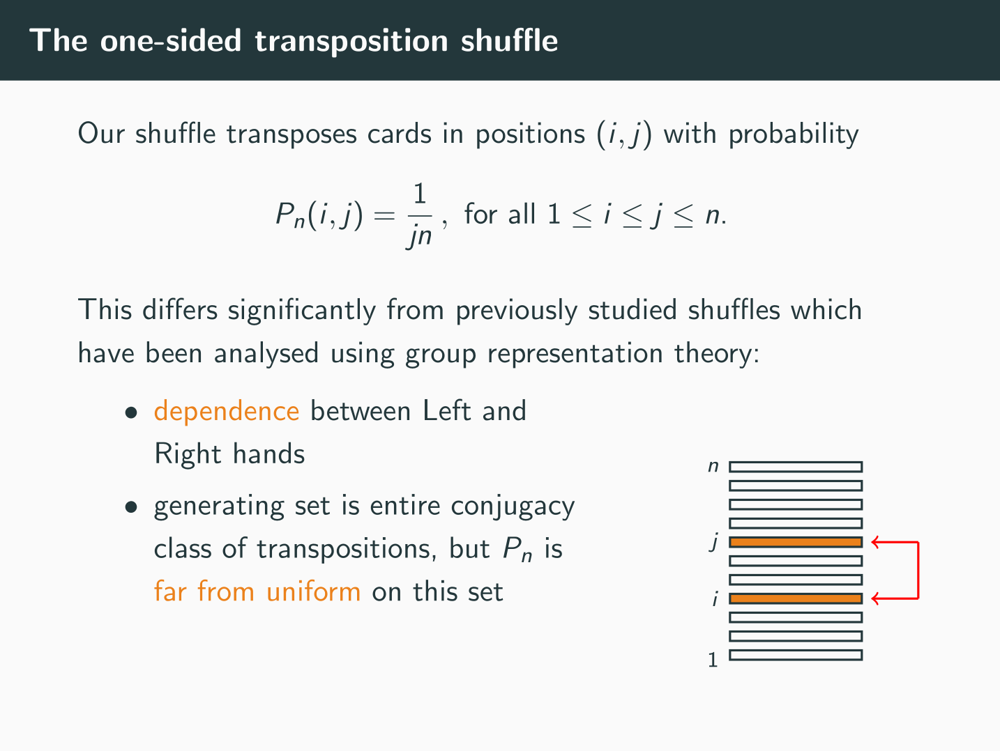
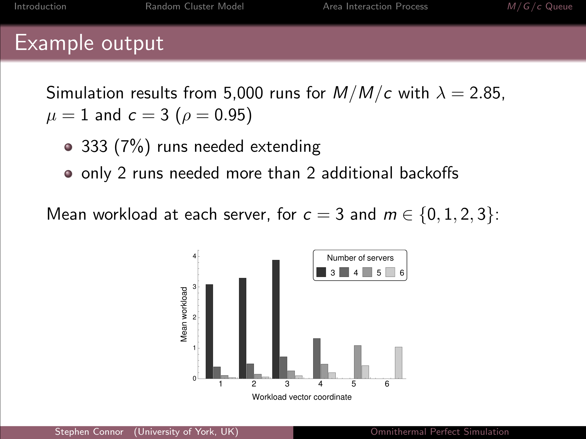
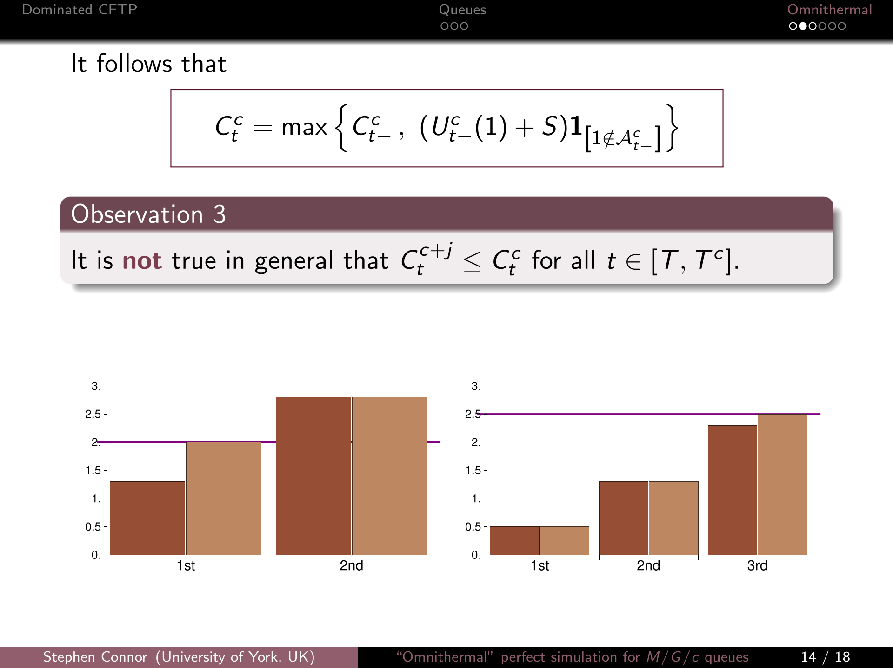
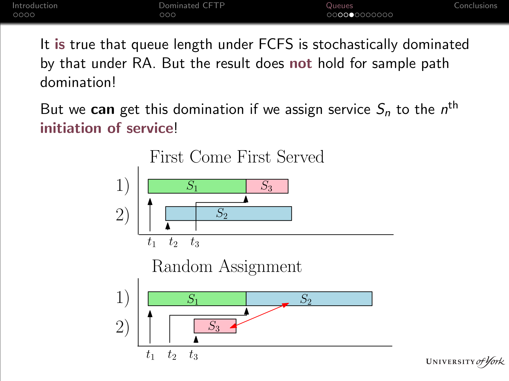
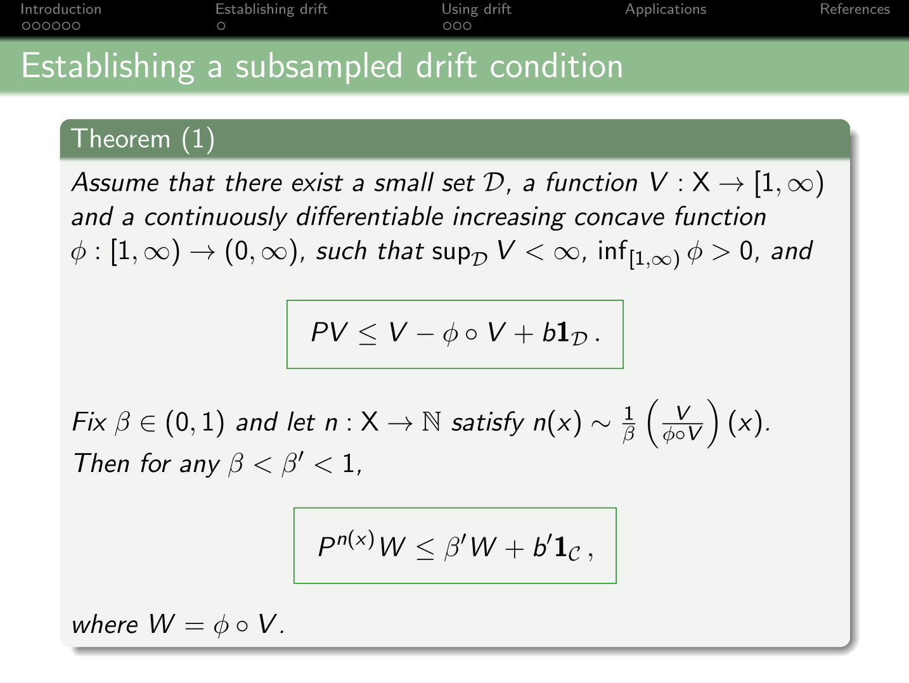
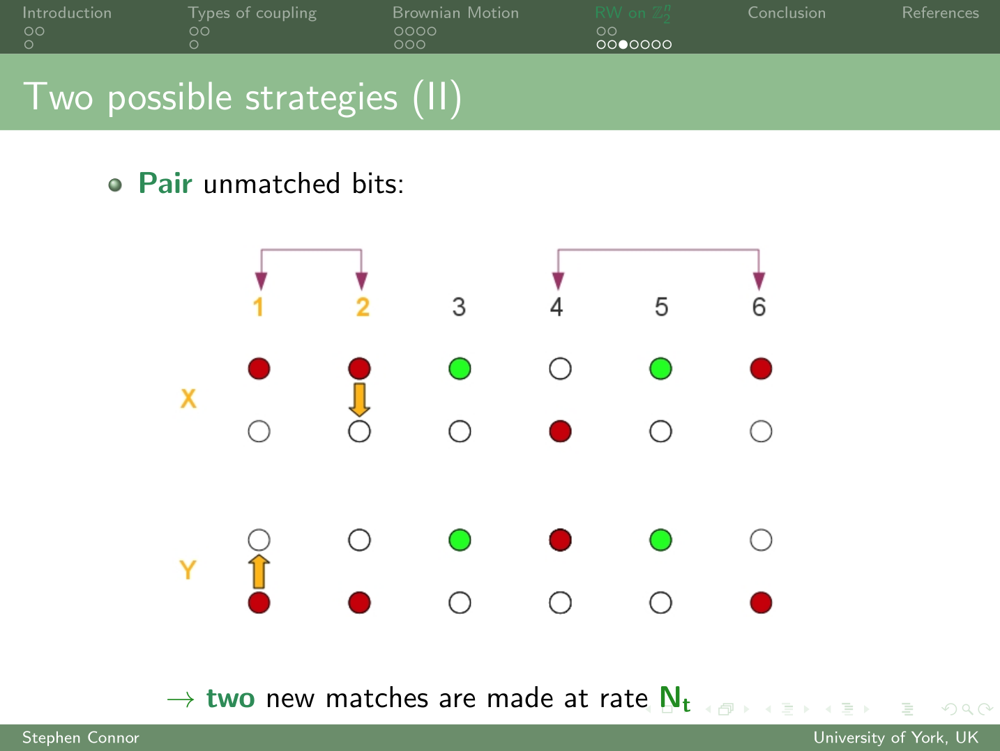

### Shuffling cards via one-sided transpositions
:::: {.columns}
::: {.column width="65%"}
 [Relevant paper](publications.qmd): Cutoff for a one-sided transposition shuffle

Consider shuffling a deck of \(n\) cards as follows.
Choose one card uniformly at random with your 
Right hand; choose a card uniformly at random with your Left hand, 
conditioned not to be above your Right hand's choice;
transpose the chosen cards.\
How many of these shuffles does it take to randomise the deck?
This can be answered using a mixture of representation theory of the symmetric group, 
and a variation of some classical probability arguments.\
:::

::: {.column width="5%"}
<!-- empty column to create gap -->
:::

::: {.column width="30%"}
[{width=260}\ ](talks/OneSidedTranspositions.pdf)
:::
::::

### Omnithermal perfect simulation
:::: {.columns}
::: {.column width="65%"}
 [Relevant paper](publications.qmd): 
Omnithermal perfect simulation for multi-server queues

Suppose that we want to sample from the equilibriun 
distribution of a Markov chain, which depends on some underlying parameter.
In some situations it is possible to modify a perfect simulation
algorithm so as to sample _simultaneously_ from all distributions for which the 
corresponding parameter lies in a given range: we call this _omnithermal_ simulation.
Here we give an overview of a few of these algorithms.
:::

::: {.column width="5%"}
<!-- empty column to create gap -->
:::

::: {.column width="30%"}
[{width=260}\ ](talks/OmnithermalPerfectSimulation.pdf)
:::
::::

### Omnithermal perfect simulation for M/G/c queues
:::: {.columns}
::: {.column width="65%"}
 [Relevant paper](publications.qmd): Perfect simulation of M/G/c queues\
 [Relevant paper](publications.qmd): Omnithermal perfect simulation for multi-server queues

A number of perfect simulation algorithms allow the user to sample from the 
equilibrium distribution of the Kiefer-Wolfowitz workload vector for stable 
\(M/G/c\) and \(GI/GI/c\) queues. This talk looks at how some 
_dominated Coupling From The Past_ algorithms 
may be modified to carry out this sampling _simultaneously_ for a range of 
values of \(c\) (the number of servers).
:::

::: {.column width="5%"}
<!-- empty column to create gap -->
:::

::: {.column width="30%"}
[{width=260}\ ](talks/OmnithermalQueues.pdf)
:::
::::

### Perfect simulation for M/G/c queues
:::: {.columns}
::: {.column width="65%"}
 [Relevant paper](publications.qmd): 
Perfect simulation of M/G/c queues

This talk gives an overview of _dominated Coupling From The Past_, and then considers 
the problem of designing such an algorithm to obtain perfect samples from the equilibrium distribution of
the workload vector of a multiserver (\(M/G/c\)) queue. Some careful coupling between "First-come first-served" 
and "Random assignment" service regimes leads to an implementable algorithm, whose properties are explored.
:::

::: {.column width="5%"}
<!-- empty column to create gap -->
:::

::: {.column width="30%"}
[{width=260}\ ](talks/PerfectSimulationQueues.pdf)
:::
::::

### State-dependent Foster-Lyapunov criteria
:::: {.columns}
::: {.column width="65%"}
 [Relevant paper](publications.qmd):
State-dependent Foster-Lyapunov criteria for subgeometric convergence of Markov chains

Drift conditions are a theoretical tool for establishing the convergence rate of a 
Markov chain. Typically such a criterion only looks at a single step of the chain; 
here we explore what can be inferred if a geometric drift condition is known 
to hold for a _subsampled chain_, for which the subsampling rate is _state-dependent_. 
Applications of the results include perfect simulation algorithms, queueing theory 
and network stability.
:::

::: {.column width="5%"}
<!-- empty column to create gap -->
:::

::: {.column width="30%"}
[{width=260}\ ](talks/FLcriteria.pdf)
:::
::::

### Coupling: co-adapted vs. maximal
:::: {.columns}
::: {.column width="65%"}
 [Relevant paper](publications.qmd): Optimal co-adapted coupling for the symmetric random walk on the hypercube\
 [Relevant paper](publications.qmd): Optimal co-adapted coupling for a random walk on the hyper-complete graph
  
Suppose that we have two copies of a continuous-time random walk on the hypercube \(\mathbb{Z}_2^n\),
and we wish to _couple_ them so that they meet as quickly as possible.
What's the best way to do this, under the assumption that neither is 
allowed to "cheat" by looking ahead at what the other is going to do?\
:::

::: {.column width="5%"}
<!-- empty column to create gap -->
:::

::: {.column width="30%"}
[{width=260}\ ](talks/CoadaptedCoupling.pdf)
:::
::::
